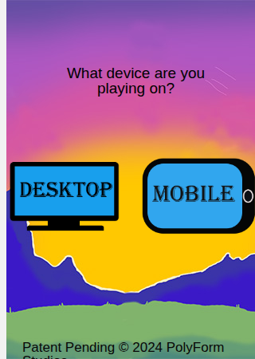
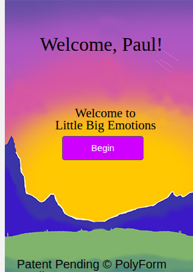
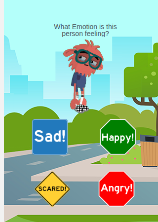
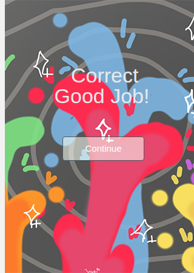

# 🎭 Little Big Emotions

An educational game that helps young players practice recognizing emotions —
**sad**, **happy**, **scared**, and **angry** — by matching a character's
expression to the correct feeling.


[Project site](https://sites.google.com/stocktonusd.org/roguetitanstudios/features/little-big-emotion) ·
[Report an issue](../../issues)

---

## Table of Contents

- [Screenshots](#-screenshots)
- [Playing it locally](#-playing-it-locally)
- [Deploying to GitHub Pages](#-deploying-to-github-pages)
- [Original development](#-original-development)
- [About this version](#-about-this-version)
- [Project structure](#-project-structure)
- [Credits](#-credits)

---

## 📸 Screenshots

<table>
  <tr>
    <td align="center"><br><sub>Device select</sub></td>
    <td align="center"><br><sub>Welcome screen</sub></td>
    <td align="center"><br><sub>Gameplay</sub></td>
    <td align="center"><br><sub>Correct!</sub></td>
  </tr>
</table>

## ▶️ Playing it locally

No build step, no dependencies — it's a static site.

```bash
git clone <this-repo-url>
cd little-big-emotions
python3 -m http.server 8000
# then open http://localhost:8000
```

Or just double-click `index.html` to open it directly in a browser.

## 🚀 Deploying to GitHub Pages

1. Push this repo to GitHub.
2. Go to **Settings → Pages**.
3. Under **Source**, pick the branch this code is on (e.g. `main`) and the
   root folder.
4. Save — GitHub will give you a live URL a minute or two later.

## 🏫 Original development

This game was originally built in **[App Lab](https://code.org/educate/applab)**,
the block/JavaScript app-building tool from **[Code.org](https://code.org)**,
as a classroom project at Stockton Unified School District.

## 🔧 About this version

Code.org's "download/export" feature for App Lab projects currently ships a
JavaScript runtime bundle (`applab-api.js`) that doesn't self-initialize once
removed from code.org's own servers — the page loads, but none of the
buttons or screen transitions work.

To make the game run as a normal, self-contained static site (e.g. on GitHub
Pages), the original App Lab runtime was replaced with a small,
from-scratch JavaScript runtime — [`app-runtime.js`](app-runtime.js) — that
implements only the handful of App Lab commands this game actually uses:
`onEvent`, `setScreen`, `setProperty`, `getProperty`, `getText`, `playSound`,
`stopSound`, `randomNumber`, `timedLoop`, `stopTimedLoop`. The original game
logic in [`code.js`](code.js), written by the credited student programmers,
is unchanged aside from small fixes.

## 📁 Project structure

```
.
├── index.html          # Screens and layout, as designed in App Lab's Design tab
├── style.css            # Per-control styling, as set in App Lab's Design tab
├── code.js               # Game logic, written by the student programmers
├── app-runtime.js        # Replacement runtime (see "About this version" above)
├── assets/               # Images, gifs, and sound effects
├── screenshots/          # Images used in this README
└── applab/
    └── applab.css        # App Lab's base stylesheet (kept for visual styling;
                           # its companion applab-api.js is no longer used)
```

## 🙌 Credits

| Role | Teacher | Students |
|---|---|---|
| **Programmers** | David Jimenez | Paul Consuelo-Valencia, Nader Baptiste |
| **Asset Designers** | George Brais | Jack Alorro, Carlos Marez, Dwayne Miranda, Sena Sek Mendoza |

---

<sub>Patent Pending © 2024 PolyForm Studios</sub>
